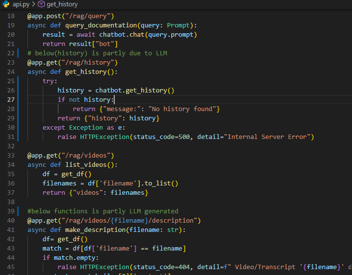
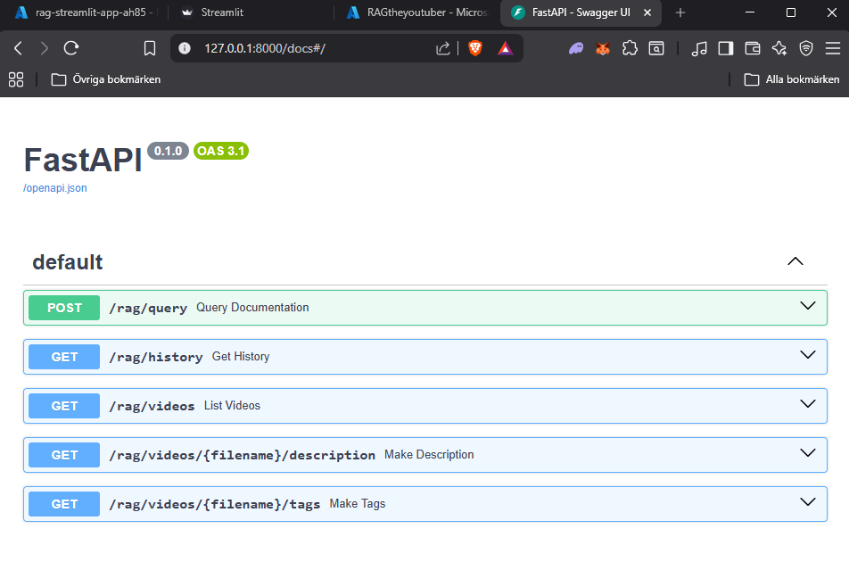
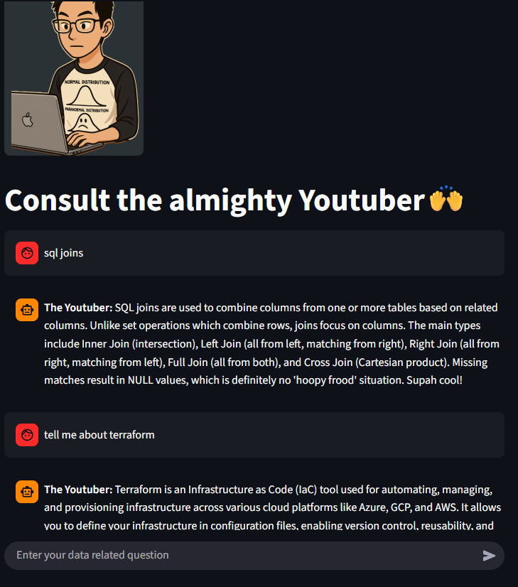

# Välkommen till mitt repo för min RAG AI chatbot
Detta låter dig ställa frågor direkt till en databas med transcipts från nästan 50 Youtube videos. Finns även andra användbara API endpoints som ger dig 20-40 keywords/tags för en specifik youtube transcript, och ett annat som sammanfattar hela transcriptet som en beskrivning på cirka 4-6 meningar. Öppna Swagger UI och kika! Transcripten är sparade som vektorer i en lancedb som vi låter en gemini modell ha access till för att svara på frågor angående dess innehåll. Frontend och backend är 'decoupled' vilket kort fattat menar att de inte är i direkt kontakt med varandra, frontend hämtar data från backend via ett API lager, som ligger emellan dom



# Quick Start

## Setup

Initiera projektmiljön:
```bash
uv init
```
 Installera beroende:
```bash
uv sync
```
Se till att du har din Google API nyckel sparad såhär i en fil som heter .env i projekt rooten:
```env
GOOGLE_API_KEY=din_google_api_nyckel_här
```
Konvertera .md-filer till .txt och ta bort dubbletter: Innan du kan indexera dina filer i databasen, måste du först konvertera .md-filer till .txt samt ta bort eventuella dubbletter:
```bash
uv run backend/md_to_text.py
```
Indexera data i LanceDB och generera vektorer: För att fylla databasen med dina dokument och skapa vektorer för sökning, kör:
```bash
uv run ingestion.py
```

## Starta API't
```bash
uv run uvicorn api:app --reload
```
Öppna http://127.0.0.1:8000/docs för att kolla in flera endpoints. OBS! notera att nedan frontend app inte är beroende av du kör kommandot ovan, utan det är mer för att utforsta olika endpoints

## Starta frontend appen
```bash
uv run streamlit run frontend/app.py
```
Öppna http://localhost:8501 



## Obs
Se till att du är i projektets rotmapp när du kör kommandona.

Enjoy!